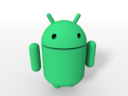

# AndroidRobot

A 3-D model of Google’s Android™ robot, with posable head and limbs.

Note: This is a **beta version** of AndroidRobot 6.0.

This project is a module from the Persistence of Vision Raytracer (POV-Ray) Object Collection.

Android is a trademark of Google LLC. The Android robot is reproduced or modified from work created and shared by Google and used according to terms described in the [Creative Commons 3.0 Attribution License](https://creativecommons.org/licenses/by/3.0/). The source code is licensed under the LGPL 3.
